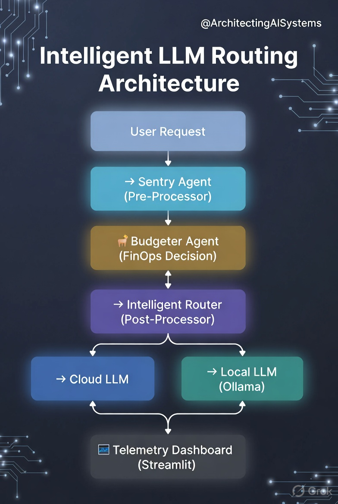

🛡️ Guardian-Mesh (The Governance Control Plane)

Guardian-Mesh is an enterprise-grade architectural prototype designed to solve the three biggest barriers to AI adoption:

🔐 Data Privacy (PII Leakage)
💰 Uncontrolled LLM Costs (FinOps)
⚠️ Hallucinations & Unreliable Outputs

It acts as a Zero-Trust AI Proxy Layer that sits between users and LLMs, enforcing governance, optimizing cost, and validating responses in real time.

🌟 Executive Summary

As enterprises scale AI, they face Shadow AI risks—unmonitored usage, data leaks, and spiraling costs.

Guardian-Mesh introduces a control plane for AI systems:

Intercepts every LLM request
Applies PII scrubbing locally
Dynamically routes requests between Cloud LLMs (Azure OpenAI) and Local SLMs (Ollama)
Validates outputs using an Agentic Audit Loop

👉 Think of it as a "Firewall + FinOps Engine + Quality Gate" for AI systems

🧠 Architecture Overview
User Request
     ↓
🛡️ Sentry Agent (Pre-Processor)
     ↓
💰 Budgeter Agent (FinOps Decision)
     ↓
🔀 Intelligent Router
     ↓
☁️ Cloud LLM  |  🖥️ Local LLM (Ollama)
     ↓
🔍 Auditor Agent (Post-Processor)
     ↓
📊 Telemetry Dashboard (Streamlit)

---
## Architecture Diagram

---

🚀 Key Features
🔐 Zero-Trust PII Scrubbing
Regex-based local redaction of:
Emails
API Keys
SSNs / Sensitive IDs
Ensures zero data leakage outside network
💰 Dynamic FinOps Routing
“Budgeter Agent” enforces daily token quotas
Routes:
🧠 Complex tasks → Cloud LLM (Azure OpenAI)
⚡ Simple tasks → Local SLM (Ollama)
Achieves ~40% cost reduction
🔁 Agentic Audit Loop
LangGraph-powered self-correcting workflow
Validates:
Hallucinations
Compliance violations
Risky outputs
Blocks or rewrites unsafe responses
📊 Real-Time Risk & Cost Telemetry
Streamlit dashboard showing:
Token usage
Cost saved
Blocked threats
Risk score
🛠️ Tech Stack (Enterprise Positioning)
Layer	Component	Enterprise Value
Orchestration	LangGraph	Stateful, cyclic reasoning workflows
LLM Gateway	LiteLLM + FastAPI	Vendor-agnostic LLM abstraction
Local Inference	Ollama (Llama / Phi)	Reduces cost & data egress
Governance	Custom Regex Scrubber	Zero-dependency, high-speed PII masking
Validation	Guardrails AI	Output validation & safety checks
UI / Observability	Streamlit	Real-time cost & risk visibility
⚙️ Installation & Setup
# Clone repository
git clone https://github.com/your-repo/guardian-mesh.git
cd guardian-mesh

# Create virtual environment
python -m venv venv

# Activate environment
# Windows:
.\venv\Scripts\activate
# Linux/Mac:
source venv/bin/activate

# Install dependencies
pip install --upgrade pip
pip install -r requirements.txt

# (Optional manual install)
pip install streamlit langgraph litellm pandas
▶️ Running the Project
# Start backend (if using FastAPI)
uvicorn app.main:app --reload

# Launch dashboard
streamlit run app.py
🔄 Multi-Agent Execution Flow

Guardian-Mesh replaces the traditional:

User → LLM

with a multi-agent governance circuit:

1. 🛡️ Sentry (Pre-Processor)
Detects:
PII
Prompt Injection
Uses local SLM or regex
2. 💰 Budgeter (FinOps Agent)
Reads daily quota from config
Decides:
Cloud vs Local model
3. 🔀 Router
Routes request via LiteLLM
Abstracts provider complexity
4. 🔍 Auditor (Post-Processor)
Validates response using:
Rule-based checks
Critic Agent / RAGAS
Flags:
Hallucinations
Compliance risks
5. 📊 Telemetry Layer
Tracks:
Cost savings
Risk score
Token usage