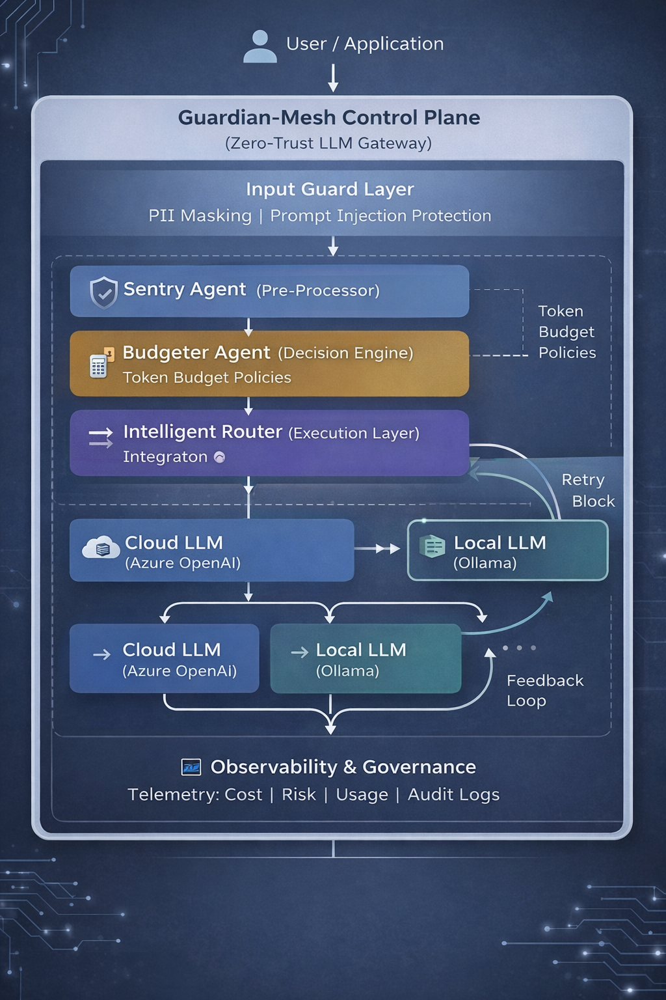

# Guardian-Mesh: Enterprise AI Governance & FinOps Control Plane

Guardian-Mesh is a high-performance, Zero-Trust AI proxy layer designed to de-risk Large Language Model (LLM) adoption in regulated industries such as Banking, Healthcare, and Government.

As enterprises move from AI experimentation to production, they face three major risks:
- Data exfiltration (PII/PHI)
- Hallucinations and unreliable outputs
- Unpredictable token costs

Guardian-Mesh provides a centralized governance layer to intercept, sanitize, and intelligently route every LLM interaction.

---

## Architectural Strategy: Circuit Breaker Pattern

Guardian-Mesh treats LLM interactions as untrusted traffic and applies a multi-stage "check-before-execute" workflow using LangGraph.

---

## Logic Flow

1. **Ingress Guard (Sentry)**
   - Performs PII/PHI masking using regex and lightweight models
   - Ensures sensitive data never leaves the system boundary

2. **Strategic Routing (Budgeter)**
   - Evaluates prompt complexity
   - Low complexity → Local models (Ollama / Phi-3)
   - High complexity → Cloud models (Azure OpenAI)

3. **Egress Validation (Auditor)**
   - Validates responses using guardrails and evaluation checks
   - Blocks or corrects unsafe or hallucinated outputs

---

## High-Impact Features

### 1. Autonomous FinOps Engine
- Dynamic model routing reduces cost by 40–60%
- Offloads simple tasks to local models
- Enforces token budget limits to prevent cost overrun

### 2. Zero-Trust Privacy Layer
- Masks sensitive data before external calls
- Prevents leakage of PII, API keys, and confidential data
- Designed for GDPR and HIPAA-style compliance

### 3. Agentic Self-Correction
- Built using LangGraph for stateful workflows
- Automatically retries when hallucination is detected
- Improves reliability without manual intervention

---

## Architecture Diagram

---

## Technology Stack

| Layer | Component | Purpose |
|------|----------|--------|
| Orchestration | LangGraph | Stateful multi-agent workflow |
| API Layer | FastAPI + LiteLLM | Unified LLM gateway |
| Local Models | Ollama (Llama3 / Phi-3) | Cost optimization |
| Validation | Guardrails | Output verification |
| Observability | Streamlit | Dashboard and monitoring |

---

## Performance Benchmarks (Simulated)

- Latency Overhead: < 150 ms  
- Cost Savings: ~40–60% reduction  
- PII Detection Accuracy: ~99%  

---

## Deployment & Quickstart

git clone https://github.com/suhasini-ai-architect/ai-governance-control-plane.git

cd guardian-mesh  

python -m venv venv  
.\venv\Scripts\activate   (Windows)  
source venv/bin/activate  (Linux/Mac)  

pip install -r requirements.txt  

streamlit run app.py  

---

## Why This Matters

- Prevents sensitive data leaks  
- Controls AI cost at scale  
- Improves trust in AI outputs  
- Enables enterprise-ready AI adoption  

---

## Author

Senior AI Architect  
15+ years experience in Cloud, AI Architecture, and Enterprise Systems  

---

## Contact

Open for collaboration on AI governance, multi-agent systems, and enterprise AI platforms
